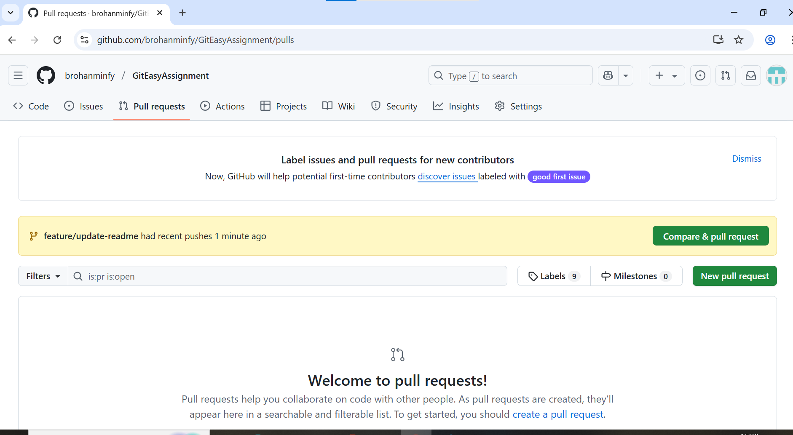
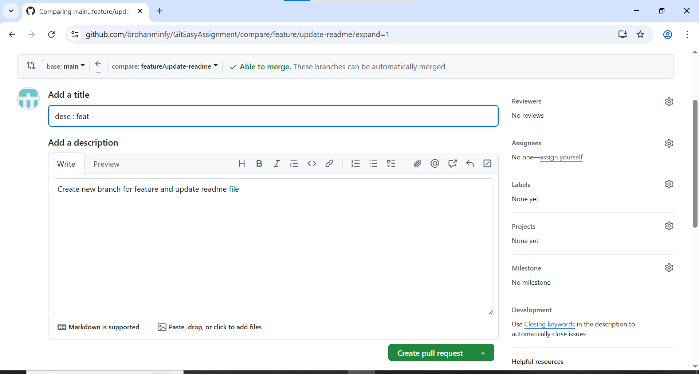
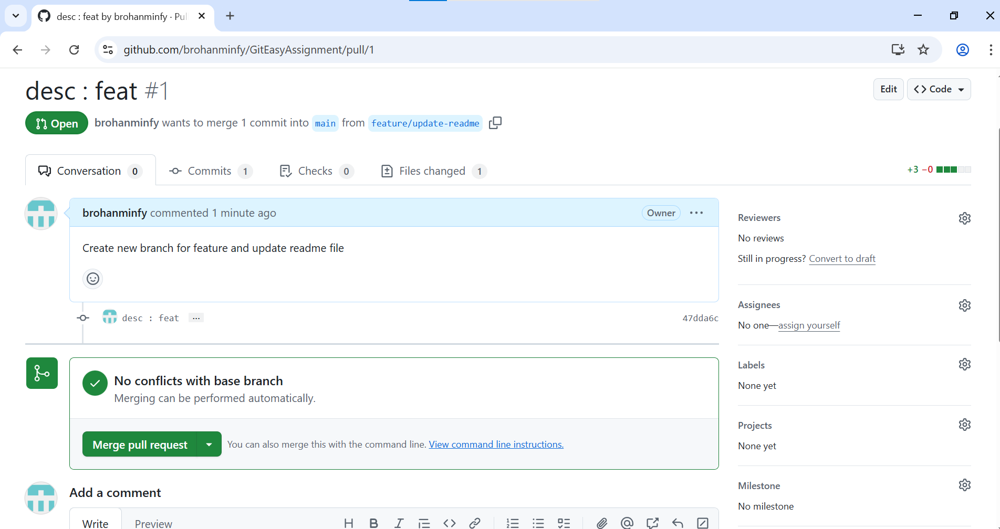
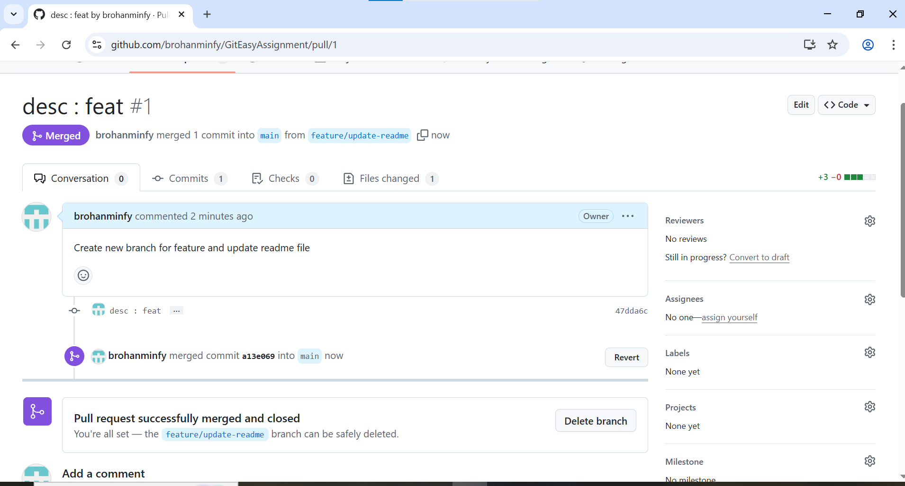

# GitEasyAssignment
Assignment 1: Basic Git Workflow

<h1> Git Log </h1>

<h1> Git Commits </h1>

<h1>Commit Explanation</h1>
<ul>
<li> <b>Initial Commit </b>: Add 5 lines in text file to start with </li>
<li> <b>First Commit </b> : Add about Company details and used commit message convections </li>
<li> <b>Second Commit </b> : Add about project details and used commit message convections </li>
<li> <b>Third Commit </b> : Add about Certifications and Expirence details and used commit message convections</li>
</ul>

<h1> Updated README.md File For 2nd Assignment </h1>

<h2> Pull Request dialogue</h2>

<h3>Pull request page</h3>

<h3>Creating Pull Request</h3>

<h3>Merge Pull Request</h3>

<h3>Final Merge</h3>

