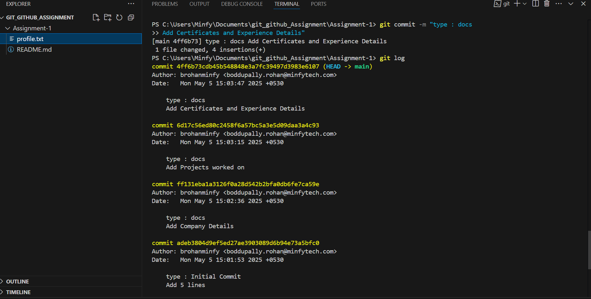
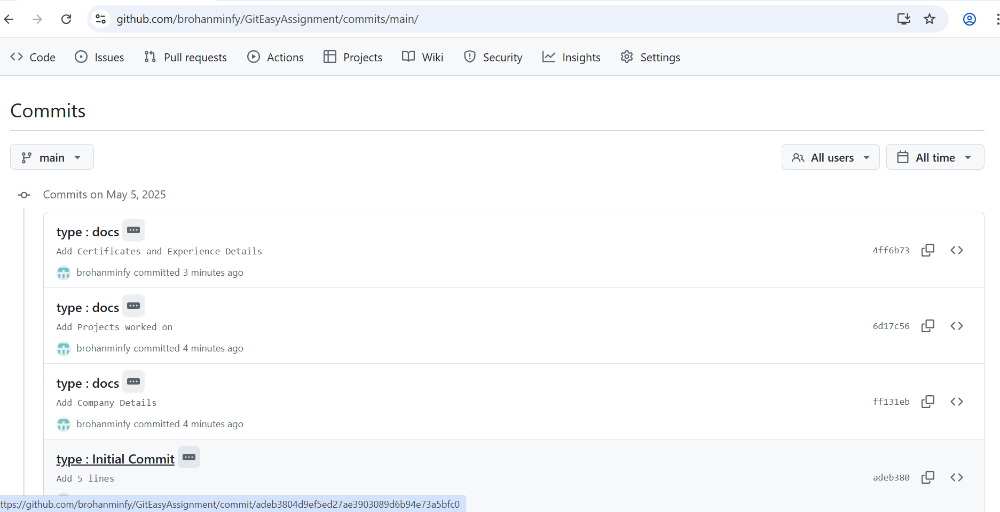

# GitEasyAssignment
Assignment 1: Basic Git Workflow

<h1>Commit Explanation</h1>
<ul>
<li> <b>Initial Commit </b>: Add 5 lines in text file to start with </li>
<li> <b>First Commit </b> : Add about Company details and used commit message convections </li>
<li> <b>Second Commit </b> : Add about project details and used commit message convections </li>
<li> <b>Third Commit </b> : Add about Certifications and Expirence details and used commit message convections</li>
</ul>